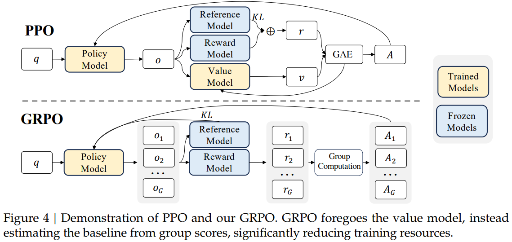

<!-- JPW的Markdown笔记模板 v1, 其中的href需要视情更改上级目录href="../../format.css -->
<link rel="stylesheet" type="text/css" href="../../format.css">

<h1>LLMs系列进阶：对齐微调之强化学习GRPO</h1>

💡 Group Relative Policy Optimization (GRPO)组相对策略优化，是PPO的变体，保留奖励模型和优势函数计算损失，但抛弃需要学习的值函数模型baseline，转而使用一个input的多个output的奖励平均值作为baseline。

   

GRPO与PPO的流程如上，使用策略模型生成一个input的一组outputs，用于：
- 将这些outputs与参考模型的输出分布进行KL散度正则化，防止策略模型过多偏离参考模型。
- 将这些outputs输入奖励模型获取一组奖励值r，取平均后作为优势函数的baseline，再分别计算每个r与平均值的差异作为损失函数。

与PPO的区别在于
- 放弃了critic model/值模型（作为优势函数A的baseline），值函数模型通常是一个与策略模型大小相当的模型，这带来了显著的内存和计算负担；此外，在 LLMs 的上下文中，值函数在训练过程中被用作优势计算中的Baseline，但通常只有最后一个 token 会被奖励模型赋予奖励分数，这可能使得值函数的训练变得复杂。相反，GRPO根据小组得分估算基线，大大减少了训练资源。
- 直接在损失函数中加入策略模型和参考模型之间的 KL 散度来正则化，而不是在奖励中加入 KL 惩罚项，从而简化了训练过程。

此外，论文中提出该工作提供了一个**统一的范式**来理解不同的方法，如拒绝采样微调（RFT）、直接偏好优化（DPO）、PPO和GRPO。基于这种统一的范式，我们发现所有这些方法都被概念化为直接或简化的强化学习技术。

总体而言，对于每个问题i，GRPO从旧策略$\pi_{\theta}$中采用一组G个输出${i_i, i_2,..., i_G}$，然后通过最大化以下目标函数优化策略模型：
$$
L_{GRPO}(\theta)= 

\frac{1}{G}\sum_{i=1}^{G}\frac{1}{|o_i|}\sum_{t=1}^{|o_i|}
    \{
        \min[
            \frac{\pi_{\theta}(o_{i,t}|q, o_{i<t})}{\pi_{\theta_{old}}(o_{i,t}|q, o_{i<t})}\hat A_{i,t}, 
            
            \text{clip}( \frac{\pi_{\theta}(o_{i,t}|q, o_{i<t})}{\pi_{\theta_{old}}(o_{i,t}|q, o_{i<t})}, 1-\epsilon, 1+\epsilon)\hat A_{i,t},
        ]
        -
        \beta D_{KL}[\pi_{\theta}||\pi_{ref}]
    
    \}
$$

其中i是输出的序号，t是token的序号，$A_{i,t}$是基于组内奖励均值的相对优势估计。此外，与PPO的反向KL散度
$$
-\beta \log \frac{\pi_{\theta}(o_{i,t}|q, o_{i<t})}{\pi_{ref}(o_{i,t}|q, o_{i<t})}
$$
不同，GRPO使用下面的无偏估计（正向KL散度）来估计KL散度：

$$
D_{KL}[\pi_{\theta}||\pi_{ref}] = \frac{\pi_{ref}(o_{i,t}|q, o_{i<t})}{\pi_{\theta}(o_{i,t}|q, o_{i<t})} - \log \frac{\pi_{ref}(o_{i,t}|q, o_{i<t})}{\pi_{\theta}(o_{i,t}|q, o_{i<t})} - 1
$$

最后，上式采用的是结果监督强化学习，即在每个输出的最后一个token处才提供标准奖励计算损失（基于sequence均值），这可能不足以有效监督复杂数学任务中的策略；论文中也提到了使用过程监督强化学习的范式，即它在每个推理步骤结束时提供奖励（每个token层面）。