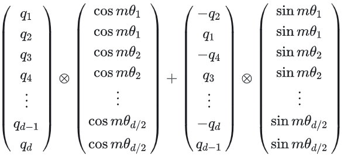
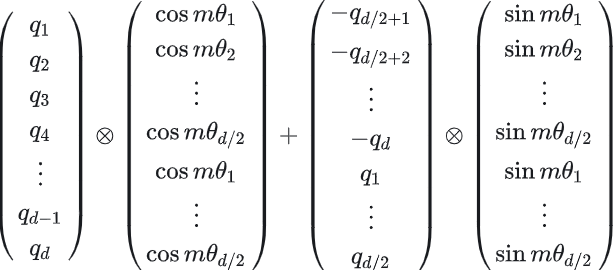

<!-- JPW的Markdown笔记模板 v1, 其中的href需要视情更改上级目录href="../../format.css -->
<link rel="stylesheet" type="text/css" href="../../format.css">


<h1>LLMs系列进阶：旋转位置编码RoPE</h1>

💡 由于Attention结构的核心在于计算最新查询Token对所有键Token的注意力，而这一可并行化的计算具有排列不变性，即交换token的位置后计算结果不变。排列不变性虽然使得attention计算可以高度并行化，但丢失了token语序信息。为了保留可并行特点同时保留语义信息，需要对token进行位置编码（Positional Encoding），或者说位置性的编码。

本章的重点是RoPE及其流程原理
```python
# 1 预先构建编码向量
## 1.1 初始化theta序列：
inv_freq = 1 / 10000**(torch.arange(0, self.qk_dim, 2)/ qk_dim)
## 1.2 position_ids序列
seq_idx = torch.arange(seq_len)
## 1.3 外积
idx_theta = torch.outer( seq_idx, theta).float()
## 1.4 编码形成cos/sin一组
cache = torch.stack( [torch.cos(idx_theta), torch.sin(idx_theta)], dim=-1)

# 2 应用
## 2.1 输入reshape
xshaped = X.reshape( batch_size, num_heads, seq_len, qk_dim // 2)
## 2.2 编码量reshape
rope_cache.reshape( 1, 1, seq_len, qk_dim // 2, 2 )
## 2.3 旋转
x_out2 = torch.stack(
    [
        xshaped[..., 0] * rope_cache[..., 0] - xshaped[..., 1] * rope_cache[..., 1],
        xshaped[..., 1] * rope_cache[..., 0] + xshaped[..., 0] * rope_cache[..., 1]
    ],
    dim = -1
)
## 2.4 展平并reshape
x_out2 = x_out2.flatten(3).reshape( batch_size, num_heads, seq_len, qk_dim)
```


# 1. 位置编码的类型
位置编码的原理是对输入序列中的token表示进行位置信息（绝对或相对）的注入。位置编码经历了范式上的编码，逐渐发展成如今适用于Transformer的编码，具体可参见[***Transformer学习笔记一：Positional Encoding（位置编码） - 猛猿的文章 - 知乎***](https://zhuanlan.zhihu.com/p/454482273)。简单来说，位置编码可以分为绝对和相对两种：

## 1.1 绝对位置编码
对embedding向量进行位置编码，有如下几种类型：
- **用整型值标记位置**：较为通用且直观，但无界且量纲上与浮点隐藏状态不匹配，不适用于Attention。
- **用[0,1]范围浮点数表示**：如Learned Positional Embedding(学习式编码)，机械切分，无法外推。早期的BERT, Roberta, GPT, GPT2使用的就是这种，最早使用则可溯源至2017年Facebook的一篇论文Convolutional sequence to sequence learning。Transformer原始论文中也提到了这个方法并用于对比实验，实验结果是Transformer的位置编码方案（Sinusoidal）与这种可学习的方案的结果差不多，但这种方案无法外推extrapolate至超过最大可编码长度的序列（目前也有研究表明可以通过其他方式让学习式编码具备外推的能力）。
- **二进制编码**：用n位二进制的隐藏状态就可以表示$2^n$个词，但维度上与Embedding不匹配会有空值，且离散
- **用周期函数如三角函数sin**：如Sinusoidal正弦曲线编码，范围固定[-1,1]浮点数，连续，可外推，三角函数和差化积、积化和差的特性可以编码相对位置信息。但这种表示是非线性的，有待改进。实际上这个方法并没有很优越，只有Transformer, Transformer XL在使用。

$$
sin(x+\Delta x)=\sin(x)\cos(\Delta x)+\cos(x)\sin(\Delta x)=[
\begin{matrix}
  \sin x & \cos x 
\end{matrix}]
[\begin{matrix}
  \cos \Delta x  \\ \sin \Delta x
\end{matrix}]
$$

## 1.2 相对位置编码
对qk向量进行位置编码，如下两种类型为主：
- **三角函数坐标系（一对sin和cos）**：如RoPE旋转位置编码，具备以上所有优点，主流大模型使用。为了表示线性变换，可以引入**三角函数坐标系**，将输入的x理解为角度$\theta$。那么直角坐标系中的一个位置就可以写作一对正余弦三角函数。
$[\begin{matrix}
  \sin x \\ \cos x 
\end{matrix}]$
此时其经过一个线性变换可以表示任意相对位置的旋转（即$x+\Delta x$视作$x$的旋转），$[
\begin{matrix}
  \sin x +\Delta x\\ \cos x+\Delta x 
\end{matrix}]$。

- **简化编码**：如ALibi，在Bloom、Falcon、MPT。直接对token之间的距离施加惩罚（下三角），例如两个token相隔一位则在attn_weights上-1。对multi-head情况则设计坡度系数如下：
$$
m=
\begin{Bmatrix}
  2^\frac{-8}{i}, i\in [1,2,..., n]
\end{Bmatrix}
$$

# 2. RoPE代码
原始论文中的旋转思路是对嵌入维度的每对相邻维度分量进行旋转（2i和2i+1，公式如下：
$$
\begin{bmatrix} 
    e'_{2i}, e'_{2i+1}
\end{bmatrix} = 

\begin{bmatrix} 
    cos(\theta_i), -sin(\theta_i) \\
    sin(\theta_i), cos(\theta_i)
\end{bmatrix} ·
\begin{bmatrix} 
    e_{2i} \\ e_{2i+1}
\end{bmatrix}

$$
上式的核心在于对编码后的偶数位使用-sin。但实现层面目前主流的旋转对象是对嵌入维度整体对半旋转（i和d/2+i一对）。前者的实现有GLM，后者有Llama和Mistral。

## 2.1 相邻维度成对旋转
<p align="center">
  <br>
</p>

```python
import torch
import torch.nn as nn

class RotaryEmbedding( nn.Module ):
    """即用即算"""
    def __init__(self, qk_dim, device = None, dtype = None ):
        """param qk_dim: Query和Key的维度"""
        super().__init__()
        self.dim = qk_dim
        inv_freq = 1.0 / (10000 ** (torch.arange(0, qk_dim, 2, device=device, dtype=dtype ) / qk_dim ))
        self.register_buffer( "inv_freq", inv_freq)

    def forward_impl( self, seq_len, n_elem, device, dtype, base = 10000 ):
        theta = 1.0 / (10000 ** (torch.arange(0, n_elem, 2, device=device, dtype=dtype ) / n_elem ))
        seq_idx = torch.arange( seq_len, dtype=torch.float, device=device )
        idx_theta = torch.outer( seq_idx, theta).float()
        # 将cos, sin包装为相邻成对
        cache = torch.stack( [torch.cos(idx_theta), torch.sin(idx_theta)], dim=-1)
        return cache
    
    def forward( self, max_len ):
        return self.forward_impl(
            max_seq_len, self.dim, dtype=self.inv_freq.dtype, device=self.inv_freq.device
        )


def apply_rotary_pos_emb( X, rope_cache):
    """
    param X: [batch_size, num_heads, seq_len, qk_dim]
    param rope_cache: [seq_len, qk_dim//2, 2]，cos和sin的编码
    [X2i, X2i+1] * [[ cos2i, -sin2i ]
                    [ sin2i, cos2i ]] = [RoPE_X_2i, RoPE_X_2i+1]
    """
    batch_size, num_heads, seq_len, qk_dim = X.shape
    # 将最后一个维度拆分为qk_dim // 2个两两一组的相邻维度
    xshaped = X.reshape( batch_size, num_heads, seq_len, qk_dim // 2, 2)
    rope_cache = rope_cache.reshape( 1, 1, seq_len, qk_dim // 2, 2 )
    # 旋转位置编码：X2i = cos2i*X2i - sin2i*X2i+1, X2i+1 = cos2i*X2i+1 + sin2i*X2i
    x_out2 = torch.stack(
        [
            xshaped[..., 0] * rope_cache[..., 0] - xshaped[..., 1] * rope_cache[..., 1],
            xshaped[..., 1] * rope_cache[..., 0] + xshaped[..., 0] * rope_cache[..., 1]
        ],
        dim = -1
    )
    # 从第三维度开始，将x_out2的最后一个维度合并到第二个维度，即[batch_size, num_heads, seq_len, qk_dim]
    x_out2 = x_out2.flatten(3)
    return x_out2.reshape( batch_size, num_heads, seq_len, qk_dim)

```


## 2.2 维度整体对半旋转

<p align="center">
  <br>
</p>


```python
import torch
import torch.nn as nn
class MistralRotaryEmbedding(nn.Module):
    """Mistral和Llama等模型的旋转位置编码，不采用论文相邻维度旋转，而是维度整体对半旋转"""
    def __init__(self, qk_dim, max_positions = 151643, base = 10000, device = None):
        super().__init__()
        self.dim = qk_dim
        self.max_postions = max_positions
        self.max_seq_len_cached = None
        self.base = base
        inv_freq = 1.0 / ( self.base ** (torch.arange( 0, self.dim, 2, dtype = torch.int64).float().to(device) / self.dim))
        # register_buffer主要是为了不需要梯度更新的张量能被随着torch.save一起被保存设计的。考虑到一开始persistent=True（即inv_freq会被一起保存），我认为这是一个遗留的代码习惯。
        self.register_buffer( "inv_freq", inv_freq, persistent = False)

        self._set_cos_sin_cache( max_positions, self.inv_freq.device, self.inv_freq.dtype )
    
    def _set_cos_sin_cache( self, max_seq_len, device, dtype ):
        self.max_seq_len_cached = max_seq_len
        max_index = torch.arange( 0, self.max_seq_len_cached, device = device, dtype = torch.int64 )
        pos_freq = torch.outer( max_index, self.inv_freq )
        emb = torch.cat( pos_freq, pos_freq, dim = -1)
        self.register_buffer( "cos_cached", emb.cos().to(dtype), persistent=False )
        self.register_buffer( "sin_cached", emb.sin().to(dtype), persistent=False )

    def forward( self, X, seq_len = None):
        if seq_len == None:
            seq_len = 1
        elif seq_len > self.max_seq_len_cached:
            self._set_cos_sin_cache( seq_len, device=X.device, dtype=X.dtype )
        return (
            self.cos_cached[:seq_len].to(X.dtype),
            self.sin_cached[:seq_len].to(X.dtype)
        )

def rotate_half( x ):
    x1 = x[..., : x.shape[-1] // 2]
    x2 = x[..., x.shape[-1] // 2: ]
    return torch.cat( (-x2, x1), dim = -1 )

def apply_rotary_pos_emb( Q, K, cos, sin, position_ids, unsqueeze_dim = 1):
    """
    Q/K.shape: [batch_size, num_heads, seq_len, qk_dim]
    cos/sin.shape: [seq_len, qk_dim]
    position_ids.shape: [batch_size, seq_len]
    """
    # 将原始cos/sin变形为符合输入的形状# [batch_size, 1, seq_len, qk_dim]
    cos = cos[position_ids].unsqueeze( unsqueeze_dim )
    sin = sin[position_ids].unsqueeze( unsqueeze_dim )
    # 逐位乘，第二个维度自动广播。此处Rotary并非原始论文相邻维度旋转，而是整个向量对半旋转
    Q_emb = Q * cos + rotate_half(Q) * sin
    K_emb = K * cos + rotate_half(K) * sin
    return Q_emb, K_emb
```


