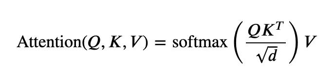
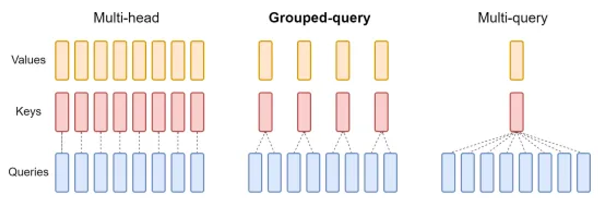
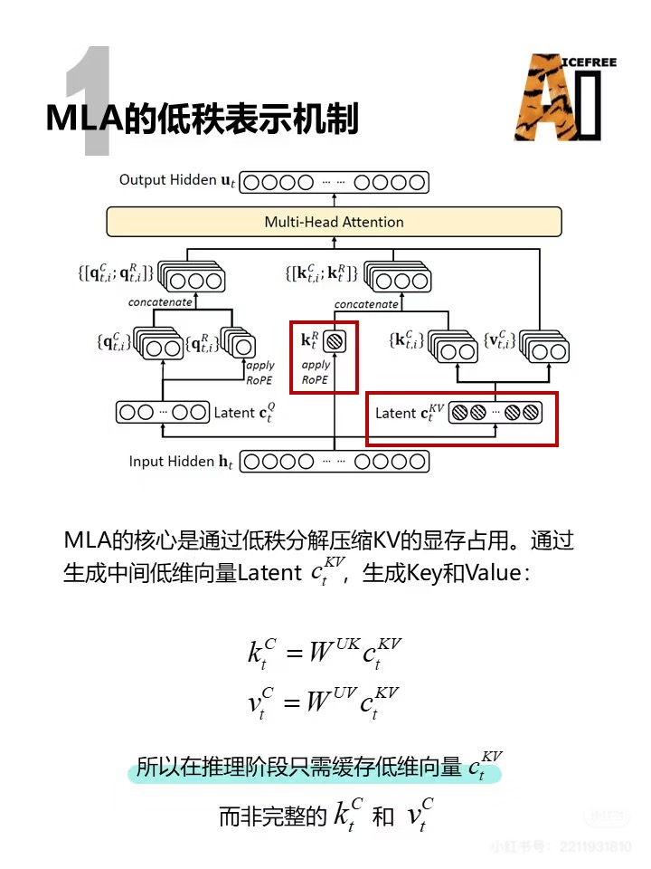

<!-- JPW的Markdown笔记模板 v1, 其中的href需要视情更改上级目录href="../../format.css -->
<link rel="stylesheet" type="text/css" href="../../format.css">


<h1>LLMs系列进阶：Attention机制</h1>
💡 Attention机制模拟生物注意力，通过查询键值对（QKV）进行计算。

# 1. 原始Attention架构：Encoder-Decoder

## 1.1 架构流程
原始Attention指的是2017年Google论文Attention is all you need中提出的注意力机制，其采用了翻译这一Seq2Seq常用的编码器-解码器架构（Encoder-Decoder）。目前主流大模型均沿用这一设定，并在此基础上修改。
<p align="center">
  <br>
</p>
如上图，原始的Attention架构包含Encoder和Decoder两个组件，每个组件由Attention主模块、MLP主模块和残差归一化辅助模块组成。

Encoder-Decoder架构主要用于机器翻译等Seq2Seq任务（输入输出为序列对），工作流程如下：
- 训练阶段：Encoder一次性接收所有输入序列转换为context vector（上下文向量），并将这个向量作为上下文提供给decoder的交叉注意力模块；decoder从开始标识符\<start>作为输入，结合encoder的输入，预测输出序列的下一个token，并和真实的token比较计算loss进行反向传播（更新encoder和decoder）。这里采用teacher forcing技巧，即每个token预测完毕后都使用真实的token作为基础预测下一个。

- 推理阶段：encoder作用一致，对输入序列表示为上下文向量，提供给decoder使用。decoder则没有输出序列作为label了，只能从\<start>作为初始输入，结合encoder输出，预测下一个token。并迭代直至生成结束标识符。

## 1.2 注意力机制的方向

根据注意力方向的不同，大模型组件可以分为Encoder（双向Attention）和Decoder（单向Attention）。前者根据前后文填空，适用于语义理解、建模类任务；后者根据前文token预测下一个token，适用于生成类任务。此外，decoder-only架构由区分为传统的Causal-decoder（注意力计算上当前token单向关注之前所有token）和Prefix-decoder（prefix部分双向关注，后半部分单向）。

原始的Attention主模块主要有三种类型。
- Multi-Head Self-Attention：（无掩码）多头自注意力
    - 自注意力：指QKV三状态向量是由同一个token embedding向量在三个不同的矩阵（QKV）上投影得到。这主用于和decoder组件中的交叉注意力cross-attention进行区别。
    - 多头：MH，将一组QKV分解为多组，每组都有自己的Q矩阵、K矩阵、V矩阵。增强并行能力、丰富模型表达、更加鲁棒。
    - 双向注意力：没有attention mask，对输入token序列中进行两两计算关注度。
    - 应用：Encoder-only架构中的注意力，以及Encoder-Decoder架构中的Encoder组件，负责表示学习。
- Masked Multi-Head Self-Attention：掩码多头自注意力
    - attention mask掩码：在训练阶段对注意力机制进行方向控制，最主流的是Causal-Decoder架构中采用的单向注意力，即当前token对自身及之前所有token进行关注，但之前token不会对当前token进行关注。此外还有Prefix-Decoder，token序列前半部分采用双向的注意力，后半部分采用单向的注意力。
    - 应用：因果模型，即Decoder-only架构，当前主流的LLMs。这种next token的预测模式适合生成任务。
- Multi-Head Cross-Attention：多头交叉注意力
    - 交叉注意力：即Q来自decoder内部前一个Attention模块的输出，KV来自Encoder模块的输出）
    - 应用：仅用于Encoder-decoder架构的decoder组件中。

核心是通过Attention Mask使得token交互只感知前向序列，即通过一个下三角有效的Mask矩阵来进行Causal掩码。

## 1.3 缩放点积注意力SDPA
<p align="center">
  <br>
</p>


在Attention原始论文中，作者比较了两种注意力方法，分别为缩放点积注意力SDPA（Scaled Dot-Product Attention）和加性注意力AA（Additive Attention）。
- 缩放点积注意力SDPA：如上式，QK点积获得token间的评分矩阵后，除以根号下key的维度进行缩放（防止了点积值过大，导致梯度消失或不稳定的情况），并用softmax进行0-1归一化（转换为概率分布，所有的注意力权重之和为 1，这样可以有效地分配注意力），然后再将缩放后的评分矩阵与V进行点积（加权求和）。相较于加性注意力，虽然都平方复杂度，但搭配硬件和数学库点积计算效率比线性投影再相加效率更高，且缩放后梯度数值更稳定。
- 加性注意力：如下，QK向量先通过线性变换W进行映射，再做相加，然后传入激活函数（如 ReLU）。这种方式计算相对较慢，因为它涉及更多的矩阵运算（尤其是加法和激活），并且没有点积那么容易并行化。
$$e_{ij}=v^Ttanh(W_qQ_i+W_kK_j)$$

# 2. MHA代码
多组QKV，可以并行计算，捕获不同的特征。
```python
import torch
import torch.nn as nn
import torch.nn.functional as F
from typing import List, Optional, Tuple

class MultiHeadAttention( nn.Module ):
    """多头注意力，qkv三者维度被均分为num_heads个部分，增强并行能力和表示能力，更鲁棒"""
    def __init__( self, config: XXXConfig):
        super().__init__()
        # config参数内化：头数、维度等
        self.num_heads = config.num_heads      # 头数，即qkv的维度被均分为多少部分
        self.hidden_dim = config.hidden_dim    # 嵌入维度embedding_dim，即输入向量的最后一个维度
        self.qk_dim = config.qk_dim            # query和key投影矩阵的维度，两者需要点积因此维度必须一致，可以任意，但通常简化为与hidden_dim一致。
        self.v_dim = config.v_dim              # value投影矩阵的维度，可以与qk和hidden_dim不一致，但通常简化为与hidden_dim一致，如Baichuan2-7B就是三者都等于hidden_dim
        self.head_dim = self.hidden_dim // self.num_heads       # 也有直接设置为config.kv_channels指定的，如chatglm3-6b
        assert self.head_dim * self.num_heads == hidden_dim , "Embedding size must be divisible by num_heads"

        # 投影矩阵组件：下面三个投影矩阵可以写为一个self.W_pack，要用时再拆分
        self.query_linear = nn.Linear( self.hidden_dim, self.qk_dim )
        self.key_linear = nn.Linear( self.hidden_dim, self.qk_dim )
        self.value_linear = nn.Linear( self.hidden_dim, self.v_dim )
        self.out_linear = nn.Linear( self.v_dim, self.hidden_dim)

        # 旋转位置编码组件
        self.max_position_embeddings = config.max_position_embeddings
        self.rotary_emb = RotaryEmbedding(self.head_dim, max_position_embeddings=self.max_position_embeddings)
    
    def forward(
        self, 
        hidden_states,                                          # 输入的embedding结果
        attention_mask: Optional[torch.Tensor] = None,          # 掩码，用于训练和batch推理mask padding
        position_ids: Optional[torch.LongTensor] = None,        # 位置id，用于Rotary旋转位置编码组件
        past_key_value: Optional[Tuple[torch.Tensor]]  = None,  # 是否有之前的Kv_cache，区分首次迭代和之后
        use_cache: bool = False,                                # 是否启用kv_cache
    ):
        """
        inputs.shape = [batch_size, token_len, hidden_state]
        """
        batch_size, q_len = hidden_states.shape[0], hidden_states.shape[1]

        Q = self.query_linear( hidden_states )
        K = self.key_linear( hidden_states )
        V = self.value_linear( hidden_states )
        # 先view重塑再transpose，可以使得张量在内存中数据的排列方式符合后续多头并行计算：
        # view 操作要求张量在内存中是连续的（contiguous），view 不会改变张量在内存中的实际存储顺序，它只是重新解释张量的形状
        # transpose 不会改变张量在内存中的实际存储顺序，但它会改变张量的步幅（stride），从而改变访问数据的方式。
        # 先将 query 重塑为 (batch_size, seq_len, num_heads, head_dim)确保 seq_len 和 head_dim 在内存中是连续的。再将 num_heads 和 seq_len 的维度交换，改变了维度顺序，但保留了每个头的 seq_len 和 head_dim 的连续性。
        # 如果直接使用 query.view(batch_size, num_heads, -1, head_dim)，虽然形状是对的，但数据在内存中的排列可能不符合多头注意力的计算需求，因为 seq_len 和 head_dim 可能不再是连续的。
        Q = Q.view( batch_size, q_len, self.num_heads, self.head_dim ).transpose( 1, 2) 
        K = K.view( batch_size, q_len, self.num_heads, self.head_dim ).transpose( 1, 2)
        V = V.view( batch_size, q_len, self.num_heads, self.head_dim ).transpose( 1, 2)

        # 对QK进行位置编码：要求是获得当前长度
        kv_seq_len = K.shape[-2]
        if past_key_value != None:
            kv_seq_len += past_key_value[0].shape[-2]
        cos, sin = self.rotary_emb( value_states, seq_len = kv_seq_len)
        Q, K = apply_rotary_pos_emb(Q, K, cos, sin, position_ids)

        # 再拼接kv_cache中的K和V
        if past_key_value != None:
            K, V = torch.cat( [past_key_value[0], K], dim = 2 ), torch.cat( [past_key_value[1], V], dim = 2 )       # 在q_len维度进行拼接
        # 更新kv_cache
        if use_cache:
            past_key_value = (K, V)

        # 进行缩放点积SDPA
        attn_output = F.scaled_dot_product_attention(Q, K, V, attn_mask = attention_mask)       # 或设置is_causal=True，也是默认单向注意力
        attn_output = attn_output.transpose(1, 2)
        attn_output = attn_output.reshape( batch_size, q_len, self.hidden_dim)

        # 最后进行混淆
        attn_output = self.out_linear( attn_output )
        return attn_output, past_key_value
```

# 3. GHA的结构变体：MQA、GQA

<p align="center">
  <br>
</p>

最原始的Attention机制采取了MHA多头注意力的结构，即QKV有多组，平分hidden_states维度。这一结构使得不同的head之间可以并行计算，且相互独立，
模型有更好的表达能力，但计算开销较大。为了降低计算开销和Kv_cache显存占用，增加上下文长度，MHA出现了变体多query注意力MQA和组query注意力GQA：
- Multi-Query Attention (MQA)：MHA的极简版本，只有Query保留多组，KV对则只有一对，多组Query共享一对KV，大大提升计算效率，但表达能力受限，性能受损。
- Grouped Query Attention (GQA)：MHA和MQA的折中，即Query分组共享多组KV对，适合需要在计算效率和模型性能之间权衡的任务。需要手动调整分组数量，增加了调参的复杂性。
总体而言，MQA是GQA在组数为1时的特例。LLaMa架构采用的注意力机制。

# 4. GQA和MQA代码
```python
import torch
import torch.nn as nn
import torch.nn.functional as F
from typing import Optional, List, Tuple

class MultiQueryAttention( nn.Mudule ):
    """
    MQA和GQA，其中前者是后者一个特例，即group数量为1。
    """
    def __init__( self, config: XXXConfig ):
        # config参数内化
        self.hidden_dim = config.hidden_dim         # embedding维度
        self.qk_dim = config.qk_dim
        self.v_dim = config.value_dim

        self.num_heads = config.num_heads           # query组数
        self.head_dim = self.qk_dim // self.num_heads

        self.num_groups = config.num_groups         # kv组数，为1时是MQA，>1时为GQA
        self.query_per_kv = self.num_heads // self.num_groups
        assert self.query_per_kv * self.num_groups == self.num_heads, "GQA组数必须可以整除Query头数"

        # 线性层实例化
        self.query_linear = nn.Linear( self.hidden_dim, self.qk_dim * self.num_heads )
        self.key_linear = nn.Linear( self.hidden_dim, self.qk_dim * self.num_groups )
        self.value_linear = nn.Linear( self.hidden_dim, self.v_dim * self.num_groups )
        self.out_linear = nn.Linear( self.v_dim * self.num_groups * , self.hidden_dim )

        # 位置编码层
        self.rotary_emb = RotaryEmbedding( self.qk_dim, max_rotary_embeddings = self.max_rotary_embeddings)
    
    def forward(
        self, 
        hidden_states,
        attention_mask: Optional[torch.Tensor] = None,
        position_ids: Optional[torch.LongTensor] = None,
        past_key_value: Optional[Tuple[torch.Tensor]] = None,
        use_cache: bool = False
    ):
        """
        hidden_states.shape = [batch_size, q_lens, hidden_dim]
        """
        batch_size, q_lens = hidden_states.shape[0], hidden_states.shape[1]
        Q = self.query_linear( hidden_states ).view( batch_size, q_lens, self.num_heads, self.qk_dim )
        K = self.key_linear( hidden_states ).view( batch_size, q_lens, self.num_groups, self.qk_dim )
        V = self.value_linear( hidden_states ).view( batch_size, q_lens, self.num_groups, self.v_dim )
        
        # 位置编码
        kv_seq_len = K.shape[1]
        if past_key_value:
            kv_seq_len += past_key_value[0].shape[1]
        cos, sin = self.rotary_emb( V, kv_seq_len )
        Q, K = apply_rotary_pos_emb(Q, K, cos, sin, position_ids)

        # KV_cache：在seq维度扩展
        if past_key_value:
            K, V = torch.cat( [past_key_value[0], K], dim = 1), torch.cat( [past_key_value[1], V], dim = 1)
        if use_cache:
            past_key_value = (K. V)
        
        # 扩展以适应MQA和GQA点积
        # 将KV的[batch_size, q_lens, num_groups, dim]四个维度的倒数第二个维度处插入一个维度，变成[batch_size, q_lens, 1, num_groups, dim]
        # 并在该第四个维度复制 num_heads // num_groups 份后与第三个的num_group维度合并，使得KV与Q在第三个维度的维数一致都等于 (num_heads // num_groups)*num_groups = num_heads，便于计算
        K = K.unsqueeze( -2 )
        K = K.expand( -1, -1, -1, self.num_heads // self.num_groups, -1)
        K = K.contiguous().view( k.shape[:2] + ( self.num_heads ,self.qk_dim) )
        V = V.unsqueeze( -2 )
        V = V.expand( -1, -1, -1, self.num_heads // self.num_groups, -1)
        V = V.contiguous().view( k.shape[:2] + ( self.num_heads ,self.v_dim) )

        # 调整形状为 batch_size, num_heads, q_lens, dim进行并行计算SDPA
        Q, K, V = [ states.transpose( 1,2 ) for states in [Q, K, V]]
        attn_output = F.scaled_dot_product_attention( Q, K, V, is_causal = True )
        attn_output = attn_output.transpose(1, 2)
        attn_output = attn_output.reshape( batch_size, q_len, self.num_groups * self.v_dim)

        # 最后进行混淆
        attn_output = self.out_linear( attn_output )
        return attn_output, past_key_value
```

# 5. 高效Attention：Flash/Page/MLA
由于Attention机制是LLMs计算的核心，而其计算复杂度是O(n^2)。具体而言，在标准的自注意力计算中，通常需要存储以下几项内容：
- QK^T（注意力权重矩阵）
- Softmax 结果
- 加权后的 V 值
为了提高计算效率，出现了一些优化加速方案。其中最著名的是Flash Attention和Page Attention。

## 5.1 Flash Attention
通过分块计算QK点积及其Softmax流水线化，大大减少内存消耗。
### 5.1.1 tiling(平铺): 分块计算
QK点积可以分块计算，但因为Attention计算中涉及Softmax，所以需要根据softmax操作的row-wise特性（即每行都算一次softmax）进行平铺分块计算。

### 5.1.2 recomputation（重新计算）
引入了 Softmax 计算的统计量，它不再将整个注意力矩阵 QK^T 存储在内存中，而是动态计算 Softmax 结果，并在每个步骤中释放无用的矩阵，进而减少显存占用。

## 5.2 Page Attention
vLLM的核心技术，借鉴操作系统内存Page命中和清退逻辑，将注意力矩阵的计算分布到多个内存页中来优化计算。
具体来说，注意力矩阵通常会占用大量内存，而 Page Attention 将矩阵划分为多个较小的 "页"，每一页可以并行处理。这种方式减少了内存的占用并提高了计算的并行性。

## 5.3 Multi-head Latent Attention (MLA)
多头潜在注意力，DeepSeek中的高效注意力机制，通过低秩联合压缩技术，将kv_cache中原本要保存的kv对用压缩后的低秩联合向量$c_t^{KV}$代替，减少推理时KV cache缓存，从而在保持性能时显著降低内存占用。

同时，MLA需要修改RoPE的使用，因为通过低秩压缩后的$k_t = RW^{UK}c_j^{KV}$，此时与$q_t^T=q_t^CR_t^T$做矩阵乘法时$q_t^CR_t^T RW^{UK}c_j^{KV}$，位置信息与作用到$W^{UK}$矩阵上而非$c_j^{KV}$上（矩阵乘法不满足交换律），因此需要将k的计算解耦，将k分为带RoPE的部分和不带的部分，分别进行计算。https://zhuanlan.zhihu.com/p/15153745590

主要思路：

<p align="center">
  <br>
</p>


### 5.3.1 对KV进行低秩联合压缩
用两个矩阵W进行线性变换，$W^{KR}$对$h_t$进行非压缩的变换用于RoPE生成$k_t^R$；$W^{DKV}$对$h_t$进行压缩的变换生成隐向量$c_t^{KV}$，再解压缩得到$k_t^C$和$v_t^C$。
- 压缩键值：先用一个下投影矩阵$W^{DKV}$将$d$维的输入$h_t$（表示第t个token的embedding）投影到$d_c$维成为latent潜在KV向量$c_t^{KV}$，其中$d_c$远远小于$d_hn_h$（dim_head*num_head），往往为1/4或1/8。
$$c_t^{KV} = W^{DKV}h_t$$

- 重建键值（实际上计算时不会解压缩，而是矩阵吸收）：然后再通过两个输入维度均为$d_c$、输出维度均为$d_hn_h$的上投影矩阵$W^{UK}$和$W^{UV}$，将压缩后的潜在KV向量$c_t^{KV}$重建为$d_hn_h$维的K和V矩阵。
$$k_t^C=W^{UK}c_t^{KV}\\v_t^C=W^{UV}c_t^{KV}$$

- 解耦键并应用RoPE：直接对输入hidden_states应用一个变换$W^{KR}$，生成解耦键矩阵。矩阵的输入维度为原始的$d$，输出维度为$d_h^R$，表示RoPE编码后的head维度。
$$k_t^R=\text{RoPE}(W^{KR}h_t)$$

- 最终KV：键由重建键和解耦键两部分组合而成，值V则是重建值。
$$k_t = [k_t^C;k_t^R]\\
v_t=v_t^C$$

### 5.3.2 对Q进行低秩压缩
与K一样，先下投影压缩到$d_c'$维度得到压缩向量$c_t^Q$，对压缩向量进行解耦和RoPE编码（也是用两个权重W分别对压缩后的进行转换），其中$W^{UQ}$用于非RoPE得到$q_t^C$，$W^{QR}$用于RoPE得到$q_t^R$。

$$c_t^Q = W^{DQ}h_t \\ 
q_t^C=W^{UQ}c_t^Q \\
q_t^R = \text{RoPE}(W^{QR}c_t^Q)\\
q_t = [q_t^C;q_t^R]
$$
上式中C表示compress压缩，R表示RoPE编码，也即QK都是压缩和编码后的组合，V仅是压缩后的。

### 5.3.3 QK计算矩阵吸收
分别对QKV进行低秩压缩后，我们得到解耦的qk和v如下
$$
q_t = [q_t^C;q_t^R] \\

k_t = [k_t^C;k_t^R] \\

v_t=v_t^C
$$

此时qk计算分为RoPE部分和非RoPE部分，非RoPE部分如下：
$$
q_t^{CT}k_t^C = (W^{UQ}c_t^Q )^T W^{UK}c_t^{KV} = c_t^QW^{UQ}W^{UK}c_t^{KV} = \\
(c_t^{QT}W^{UQT}W^{UK})c_t^{KV}
$$
通过使用矩阵乘法的结合率，先行计算前一部分，避免了各自计算最终QK矩阵过程中$W^{UK}c_t^{KV}$将压缩的向量解压缩为完整的K矩阵，优化了显存和计算量；同时，$W^{UQT}W^{UK}$部分是模型权重，可以在一开始就离线计算，加速推理过程，两个W矩阵先计算的过程叫**矩阵吸收**。同理，注意力矩阵M和V相乘过程中也可以进行矩阵吸收$output = MV = MW^{UK}c_t^{KV}$，从而避免将V也解压缩。

同理，RoPE部分如下：
$$
q_t^{RT}k_t^R = (RW^{UQ}c_t^Q )^T RW^{UK}c_t^{KV} = c_t^QW^{UQ} R^TRW^{UK}c_t^{KV} = \\
(c_t^{QT}W^{UQT}R^TRW^{UK})c_t^{KV}
$$

### 5.3.4 其他细节
- SDPA：分子一样，缩放因子从d_k变为注意力头维度加解耦QK的维度$d_h+d_h^R$，第i个head的注意力如下，j表示行（因为注意力计算是单个token对之前所有token）：
    $$\text{Score}_{t,j,i} = \frac{q_{t,i}^Tk_{j,i}}{\sqrt{d_h+d_h^R}}$$
- Softmax:
    $$\alpha_{t,j,i} = \text{Softmax}_j(\text{Score}_{t,j,i})$$
- 解耦的RoPE：原本QK都需要RoPE编码，但MLA中的QK都是由潜在空间压缩重建结果以及原始多头注意力RoPE的结果拼接而成，潜在空间中的表示并不完全依赖于输入的原始空间，而是通过编码器和解码器中间的抽象层生成的。因此，解耦的RoPE能够更好地适配这种潜在空间的表示，避免位置编码和潜在表示之间的过度耦合，允许它们独立处理从不同信息源得到的特征。