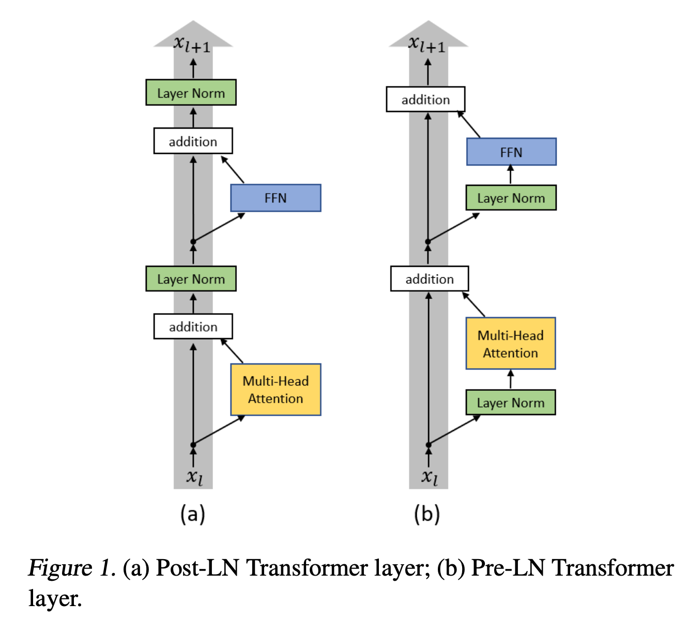
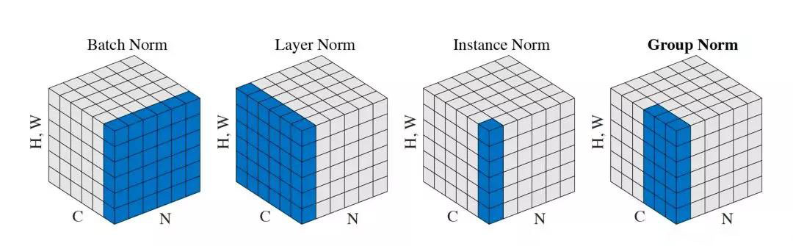

<!-- JPW的Markdown笔记模板 v1, 其中的href需要视情更改上级目录href="../../format.css -->
<link rel="stylesheet" type="text/css" href="../../format.css">


<h1>LLMs系列进阶：归一化</h1>

💡 原始Transformers归一化层放在attention和MLP后，现在主流都放在两者前面，即Attention前后都是归一化。归一化又称标准化，标准化技术主要是为了解决参数过大或过小以及其引发的梯度爆炸等问题。标准化技术通常会调整模型的输入或者是中间输入（层和层之间传递的值），调整方法通常是改变参数的分布（最常用的是将输入调整到均值为0，方差为1）。

常见的Norm手段包括Batch normalization，Layer normalization、Instance normalization、Group normalization、RMSNorm。其中RMS（均方根归一化）有可学习参数（缩放因子），以参数向量的形式保存，是当前大模型中主流采用的归一化实现，是在Layer Norm之上的改进，它通过舍弃中心不变性来降低计算量。

# 1. 归一化位置

<p align="center">
  <br>
</p>

## 1.1 PostLN
原始的 Transformer 论文中描述的模型使用的是post-normalization，即每个子模块（如Attention和MLP模块）的输出先经过计算，然后在加上残差连接之后再应用归一化。如上图左，Norm在每个Block的两大模块之后。

优点：
- 计算过程中不受归一化的影响，可能会导致更高的训练不稳定性，但某些情况下它可能能够更好地捕捉到计算结果的分布特征。
- 这种方式可能适用于需要更多上下文信息来进行归一化的场景。
## 1.2 PreLN
如上图右，PreLN在每个Block的两大模块之前。

优点：
- 使得每一层的输入在进入计算过程之前已经是归一化的，稳定了激活值的分布。
- 这种方式有助于减少梯度消失或梯度爆炸的问题，因为每层的输入都有统一的尺度。
- 在某些情况下，pre-normalization 会让模型收敛更快。

相比PostLN，使用PreLN的深层transforme的训练更稳定，但是性能有一定损伤。为了提升训练稳定性，目前主流大模型都采用了PreLN，例如GLM、GPT。


# 2. 主流归一化方法

<p align="center">
  <br>
</p>
目前主流的归一化方法可以参考何凯明Group Norm论文中上面这张经典图。其中N是批大小，C是通道数，H和W是图像的空间维度。目前主要有如下五种归一化方法，其中BatchNorm，InstanceNorm和GroupNorm针对空间数据模型如CNN（Batch内instance形状一致），LayerNorm和RMSNorm针对序列数据模型如RNN和Transformer。

## 2.1 BatchNorm：空间数据

BatchNorm主要在batch数据中进行归一，一般来说应用于图像。这种方法很难适用于序列数据，对于序列数据而言，在batch维度做归一意义不大，而且一个batch内的序列长度不同。具体而言，BatchNorm对每一个通道c在批次维度上进行归一化。
$$
\hat{x}_i = \frac{x_i-\mu_c}{\sqrt{\sigma_c^2+\epsilon}}
$$

```python
def BatchNorm(x, gamma, beta, eps=1e-5): 
    # x: input shape [N, C, H, W] 
 
    N, C, H, W = x.shape 
    mean = torch.mean(input=x, dim=[0,2,3], keepdim=True) 
    var = torch.var(input=x, dim=[0,2,3], keepdim=True) 
    # mean, var shape : [1, C, 1, 1] 
 
    x = (x - mean) / torch.sqrt(var + eps) 
 
    return x * gamma + beta
```

## 2.2 InstanceNorm：空间数据
一个batch中每个独立样本的每个通道进行归一化，通常应用于图像生成（例如 GAN）任务。它对每个样本独立进行归一化，不考虑批次间的信息。

## 2.3 GroupNorm：空间数据
GroupNorm 是对批量数据进行分组归一化。与 BatchNorm 不同，GroupNorm 将通道维度C划分为G组（而不是在整个通道维度上做均值和方差的计算），并在组内进行归一化。GroupNorm 不依赖于批次大小，因此适用于小批次训练或每个样本的特征维度差异较大的情况。

## 2.4 LayerNorm：序列数据

LayerNorm是针对序列数据提出的一种归一化方法，主要在hidden_dim维度进行归一化。例如对于一个shape=[32, 128, 512]（batch_size, seq_len, hidden_size）的输入，LayerNorm对整个序列中每个token的512维进行归一化（利用均值和方差）。具体而言，需要先计算每个token的d维（512）算均值和方差如下：

$$
\mu = \frac{1}{d}\sum_{i=1}^dx_i \\

\sigma^2 = \frac{1}{d}\sum_{i=1}^d(x_i-\mu)^2 \\

\hat{x}_i = \frac{x_i-\mu}{\sqrt{\sigma^2+\epsilon}}
$$

优点：控制数据维度分布在激活函数舒适区
- 保证训练稳定性：参数过大或过小在BP时容易跑到激活函数的dead area（梯度爆炸或消失）
- 加速收敛：分布合理后可以更快收敛
- 让训练过程不那么依赖权重初始化，减轻不同初始化方法对训练的影响

## 2.5 RMSNorm：序列数据

RMSNorm的提出是为了提升layerNorm的训练速度提出的。RMSNorm也是一种layerNorm，只是归一化的方法不同。相比layerNorm中利用均值和方差进行归一化，RMSNorm 利用均方根进行归一化。这样做的好处是避免了需要计算均值和方差的开销，并且不需要学习缩放因子γ，从而简化了计算。

$$
RMS(x) = \sqrt{\frac{1}{d}\sum_{i=1}^dx_i^2}
$$

$$
\hat{x}_i = \frac{x_i}{RMS(x)+\epsilon}
$$

```python
import torch
import torch.nn as nn

class RMSNorm( nn.Module ):
    """Root Mean Square均方根归一化，包含可学习权重缩放因子，可以补偿输入前归一化导致的部分信息丢失"""
    def __init__(self, normalized_shape, eps=1e-5, device=None, dtype=None):
        """normalized_shape一维，shape = [hidden_size] """
        super().__init()
        self.eps = config.epsilon              # 防止除以零
        self.weights = nn.Parameter( torch.empty(normalized_shape, device = device, dtype = dtype))
    
    def forward( self, hidden_states):
        """hidden_states.shape:[batch_size, seq_len, hidden_size]"""
        input_type = hidden_states.dtype
        # 对hidden_states的最后一个维度求均方
        variance = hidden_states.to(torch.float32).pow(2).mean(-1, keepdim=True)
        # 根倒数                    
        hidden_states = hidden_states * torch.rsqrt(variance + self.eps)
        # 逐元素乘法：将self.weight的形状广播到与hidden_states相同的形状。将self.weight扩展为[1, 1, hidden_size]。然后，它可以将这个形状与hidden_states的形状相匹配，并执行逐元素乘法。                    
        return (self.weight * hidden_states).to(input_dtype)
```

