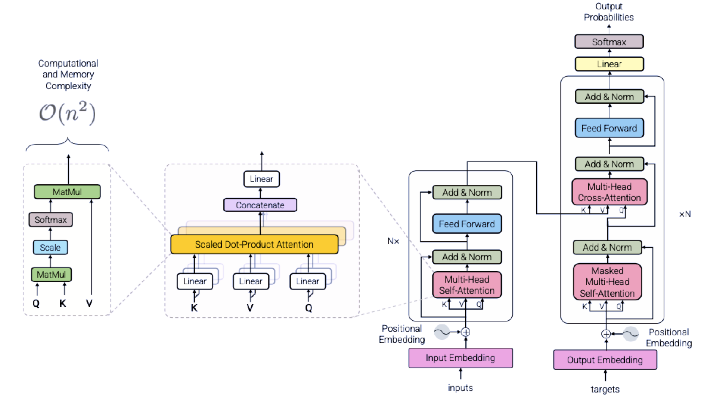

<!-- JPW的Markdown笔记模板 v1, 其中的href需要视情更改上级目录href="../../format.css -->
<link rel="stylesheet" type="text/css" href="../../format.css">

<h1>LLMs系列进阶：残差Residual与随机丢弃Droupout</h1>

💡 在大模型中，残差（Residual）和随机丢弃（Dropout）是两种常用的技术，它们在训练深度神经网络时帮助缓解梯度消失、过拟合等问题。

# 1. 残差Residual：

残差连接（Residual Connection）是一种跳过某些层，直接将前一层的输出与当前层的输出相加的机制。它最早由 ResNet 引入，并且广泛应用于各种深度学习模型，特别是在 Transformer 模型中。传统的深度神经网络中，每一层的输出都依赖于前一层的输入，而深度增加时，网络可能会遇到梯度消失或梯度爆炸问题，导致训练困难。为了缓解这些问题，ResNet 提出了残差学习的思想：每一层的输出不直接依赖于输入，而是依赖于输入的“残差”。具体位置上，都在在归一化和模块计算之后。

   

残差连接的形式通常是：Output=LayerOutput+Input。这种结构使得网络能够学习到“残差”信息，即每一层只需要学习输入与目标之间的差异，从而避免了信息丢失，提高了梯度流动。如上图，对于原始的post_norm而言，残差赋值、模块计算、归一化、加残差。而对于主流的pre_norm的Transformer结构而言，往往在每个Decoder Block内部先进行残差赋值，再经过前归一化、Attention，加上残差；复制残差，再经过后归一化，进入MLP，加上残差。（残差赋值、归一化、模块计算、加上残差）

残差的实质：允许某些信息直接绕过某些层抵达下一层。

残差的优点
- 缓解梯度问题：类似在煮面条水沸腾时加一勺冷水，再次沸腾后面条更加劲道。
- 学习每一层输入输出的差异，习得更有意义的特征，增强模型的表达能力。
- 加快收敛：梯度可以绕过某些层更快反向传播。

# 2. 随机丢弃Dropout：训练时使用，避免单个神经元过强
在每次训练过程中，Dropout 会以某个概率 p 将神经元的输出置为零。剩下的神经元的输出会按比例放大，以保持输出的期望值不变。Dropout 的目标是让模型学会多个神经元之间的合作，而不是依赖单个神经元的强大能力。这有助于防止过拟合，尤其是在训练数据较少或模型较复杂时。

使用位置：
- 模块输出：在Transformer中，每个Block的Attention和FFN层后残差连接前使用。
- attention dropout：attn_weights矩阵（注意力权重）中使用。随机丢弃部分注意力权重，模型不会过度依赖某些特定模式的注意力分配，使得注意力分配更加灵活，模型更加鲁棒。
- 对kv_cache也能使用