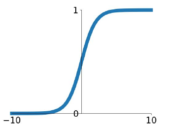
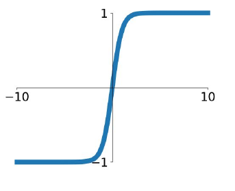
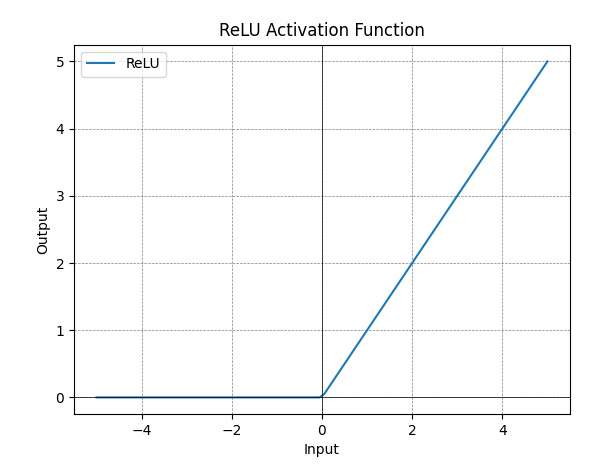
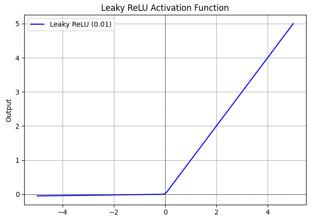
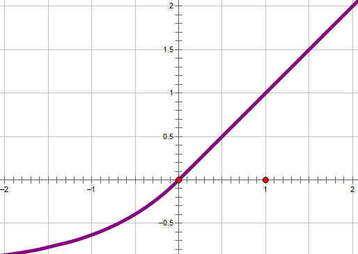
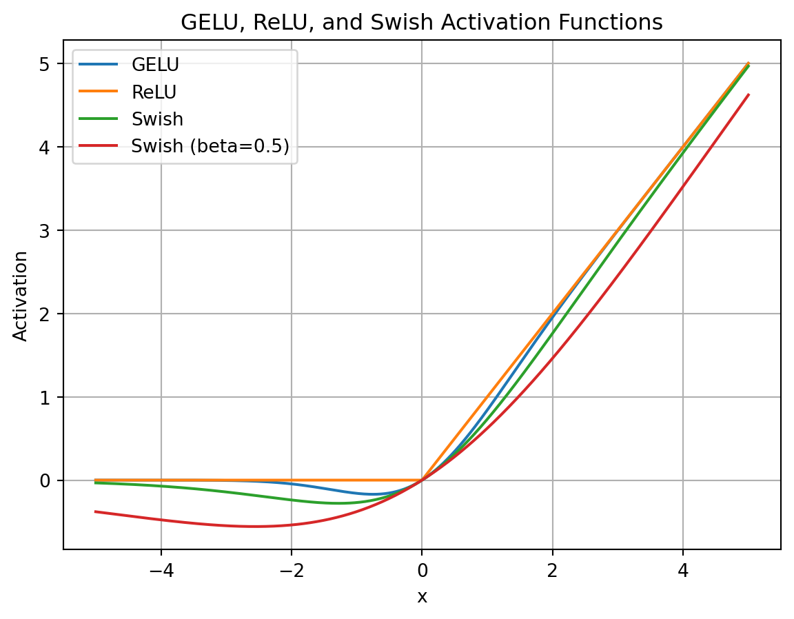
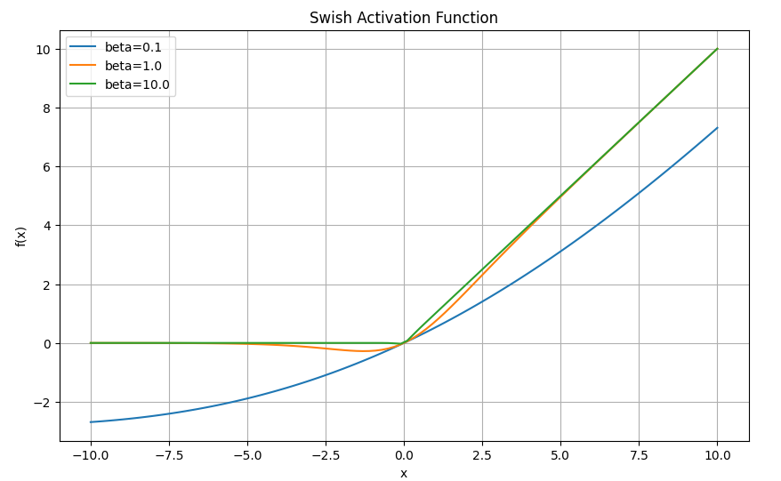

<!-- JPW的Markdown笔记模板 v1, 其中的href需要视情更改上级目录href="../../format.css -->
<link rel="stylesheet" type="text/css" href="../../format.css">


<h1>LLMs系列进阶：激活函数</h1>

💡 在此介绍常用的激活函数及其公式、优缺点。总体而言，激活函数的发展是代际更新的，新的激活函数往往基于之前缺点。

总体而言，激活函数发展经过了
- 阶跃函数：绝对理想，但过于简单
- 早期Sigmoid和Tanh等指数非线性激活
- ReLU开启的线性单元激活，如Leaky Relu, ELU, GELU，都在正数部分线性，负数部分接近0.
- SiLU, GLU, SwiGLU三者代表的引入门控与Sigmoid与自乘（x·Sigmoid(x)）的复杂激活。

# 1 Sigmoid

S曲线，经典激活函数，是阶跃的替代，也是0-1之间，不过由二元离散变为光滑连续，且中间陡峭，即大部分值都会被映射到更靠近0-1的位置。
<p align="center">
  <br>
</p>

$$\text{Sigmoid}(x)=\sigma(x)=\frac{1}{1+e^{-x}}$$

其中$e^{-x}$为恒正递减曲线

优点：
- 平滑可微：连续可导，适用于BP
- 输出范围0-1：可解释为概率，常用于二分类任务的输出层。
- 单调：输入大则大，利于决策边界学习

缺点：
- 在靠近0和1的部分曲线平缓，梯度趋近于0，在BP过程容易导致**梯度消失**权重不更新。
- 非中心对称，即上下不对称，x<0时值还是大于0，导致后一层接受的输入存在**恒为正的偏置**（偏置偏移Bias Shift），影响梯度更新。
- exp() 指数函数与其他非线性激活函数相比，计算**成本高昂**，计算机运行起来速度较慢。

因此，Sigmoid 适用于浅层神经网络，而由于梯度消失问题不用于深层神经网络的隐藏层。特别的，更多用于二分类问题的概率归一化场景作为输出层，与Softmax用于多分类问题相似。代码如下
```python
import numpy as np
# 或者import math，使用math.exp
def sigmoid( x ):
    return 1.0 / (1.0 + np.exp(-x))
```

# 2 Tanh：双曲正切函数
双曲正切，解决了Sigmoid的不对称导致的偏置偏移，但**没解决梯度消失**和**计算开销大**问题。

<p align="center">
  <br>
</p>

$$\text{Tanh}(x)=\frac{e^{x}-e^{-x}}{e^{x}+e^{-x}}$$

```python
import math
def tanh( x ):
    return (math.exp(x)-math.exp(-x)) / (math.exp(x)+math.exp(-x))
```

# 3 ReLU：整流线性单元
Rectified Linear Unit，线性函数**计算快**，这个理念深刻影响了后续很多激活函数。
<p align="center">
  <br>
</p>

$$\text{ReLU}(x)=max(0,x)$$

优点：
- 解决了Sigmoid的梯度消失、输出偏置
- 线性计算，速度快
- 负值为0，适合稀疏参数任务。

缺点：
- x<0时y为0，会造成**神经元死亡**。

```python
import math
def relu( x ):
    return max( 0, x)
```

ReLU计算速度很快，缺点很少，为了解决神经元死亡问题，分别出现了几种改进方法
## 3.1 Leaky ReLU：泄露的整流线性单元
在负数部分采用一个很小的斜率slope，使得负数部分非零但接近零。

<p align="center">
  <br>
</p>

$$\text{LeakyReLU}(x)=max(0,x)+ \text{NegativeSlope}*min(0,x)$$

```python
def relu( x, slop=0.1):
    return max( 0, x)+ slop*min(0, x)
```

## 3.2 ELU：指数线性单元
Exponential Linear Units，也是为了解决ReLU负数部分死亡的问题，**继承其所有优点**，但是**负数部分计算量过大**。

<p align="center">
  <br>
</p>

$$\text{ELU}(x)=\begin{cases} 
      x & \text{if } x > 0 \\
      \alpha*(e^x-1) & \text{if } x \leq 0 
   \end{cases}$$

```python
import math
def elu( x, alpha=0.1):
    if x >= 0:
        return max( 0, x)
    else:
        return alpha*(math.exp(x)-1)
```

## 3.3 GELU 
高斯误差线性单元(Gaussian Error Linear Units)，下式的$\Phi(x)$是高斯分布函数

<p align="center">
  <br>
</p>

$$\text{GELU}(x)=x*\Phi(x)$$

优点：
- 平滑可导
- 避免负死亡
- 与高斯分布相关，模拟噪声扰动

缺点：
- 计算开销大
- 实现较为复杂
- 硬件可能不兼容（无专门优化）

# 4 Swish/SiLU
Sigmoid Gated Linear Unit，Sigmoid和ReLU的改进版，嗖嗖声，非线性激活函数，有可学习或常数参数beta。

<p align="center">
  <br>
</p>

$$\text{Swish}(x)=x*\text{Sigmoid}(\beta x)$$

优点：
- 克服Sigmoid非对称、梯度消失等问题，保留处处可微优势
- 克服ReLU负数死亡问题，**在0附近提供更平滑转换**。

缺点：
- 非线性激活，指数计算开销大，收敛慢
- 大负值输入可能梯度消失
- 不适合稀疏表示任务

此外，部分改进版本可能会带有可学西参数beta

```python
import torch.nn.functional as F

y = F.silu(x)

# 或者
def silu( x, beta=1):
    return x*sigmoid(beta*x)
```


# 5 GLU：门控线性单元
Gated Linear Unit，两个线性变换的分量积，其中一个线性变换由sigmoid激活，和SiLU非常相似，仅区别于输入是否需要权重矩阵。不是传统的激活，因此也**无法画图**。例如Mistral的FFN层就采用门控线性单元作为激活方式，其中的激活函数可以替换为SiLU等。采用逐元素积（哈达玛积）。

$$\text{GLU}(x)=\text{Sigmoid}(W_1x+b)·(Vx+c)$$

优点：
- 增强模型对信息的选择性处理
- 增强的非线性特性

缺点：
- 计算开销大
- 难以微调

# 6 SwiGLU
2020年谷歌，结合了Swish和GLU两者的特点（两者都是x和sigmoidx相乘），是一个GLU，但不是将sigmoid作为激活函数，而是使用swish，也**无法画图**。效果表现得最好，所以现在的大模型，如LLAMA, GLM等都在其实现中采用SwiGLU。

$$\text{SwiGLU}(x)=\text{Swish}(W_1x+b)\otimes(Vx+c)$$

优点：原作者没有给出解释，归功于上帝。作为大语言模型的激活函数，主要是因为它综合了非线性能力、门控特性、梯度稳定性和可学习参数等方面的优势。
- 采用了GLU的门控特性，可以对信息流进行控制；
- 非线性能力：对于负值的响应相对较小克服了ReLU某些神经元上输出始终为零的缺点
- 采用Swish激活函数有可训练参数，灵活
- 计算效率比GeLU等复杂激活函数高，同时性能也还好，梯度稳定性

缺点：
- 计算开销大
- 调优复杂

```python
import torch.nn.functional as F
def swiglu(x):
    """x是经过上投影的隐状态"""
    x = torch.chunk(x, 2, dim=-1)
    return F.silu(x[0]) * x[1]
    # 或者 (x[0]*sigmoid( beta*x[0]))* x[1]
```